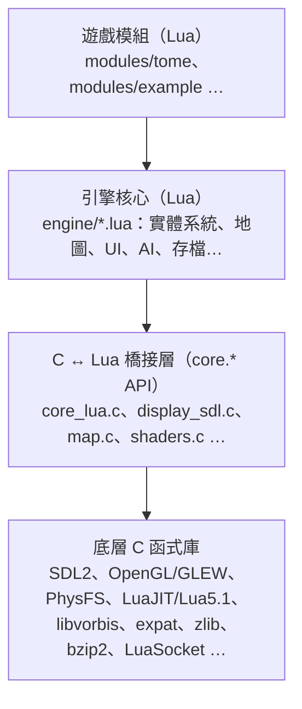

```mermaid
graph TD
    M["遊戲模組（Lua）<br/>modules/tome、modules/example …"]
    E["引擎核心（Lua）<br/>engine/*.lua：實體系統、地圖、UI、AI、存檔…"]
    B["C ↔ Lua 橋接層（core.* API）<br/>core_lua.c、display_sdl.c、map.c、shaders.c …"]
    C["底層 C 函式庫<br/>SDL2、OpenGL/GLEW、PhysFS、LuaJIT/Lua5.1、libvorbis、expat、zlib、bzip2、LuaSocket …"]
    M --> E --> B --> C
```

---
