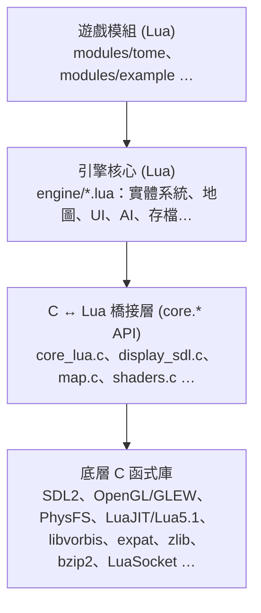

# T-Engine 4 架構總覽 (v1.7.6)

T-Engine 4 (TE4) 是採用 **C + Lua** 雙層架構的 roguelike 遊戲引擎。底層 C/SDL2/OpenGL 負責效能敏感操作，上層 Lua 實作遊戲邏輯，兩者透過 Lua C API 橋接。遊戲模組以 `.teae` / `.team` (zip) 壓縮包發佈。

## 整體分層架構

## 一、C 層模組 (`src/`)

### 1.1 入口 & 視窗管理
- **`main.c`** — 程式入口；SDL2 視窗、OpenGL context、主迴圈 (tick 排程、事件分派、FPS 控制)、搖桿支援。

### 1.2 顯示 & 渲染
| 檔案 | 功能 |
|------|------|
| `display_sdl.c / .h` | SDL2 渲染後端，FBO、材質管理 |
| `shaders.c / .h` | GLSL shader 載入、編譯、管理 |
| `map.c / .h` | 地圖圖磚快速繪製 (C 層加速) |
| `particles.c / .h` | 粒子系統渲染 |
| `glew.c / .h` | OpenGL 擴充載入 |

### 1.3 音訊
- **`music.c / .h`** — 音樂播放 (OGG/Vorbis)、音效。

### 1.4 Lua 虛擬機
- **`src/lua/`** — 標準 Lua 5.1
- **`src/luajit2/`** — LuaJIT 2.x (可替換，編譯選項決定)
- **`core_lua.c / .h`** — 將所有 C 功能注入 Lua `core.*` 命名空間

### 1.5 虛擬檔案系統
- **`src/physfs/`** + **`physfs.c`** — PhysFS，支援直接讀取 zip (`teae`/`.team`)，讓模組以單一壓縮包發佈。

### 1.6 亂數
- **`SFMT.c / .h`** — SIMD Mersenne Twister (週期 2^19937-1)。
- **`noise.c`** + **`src/libtcod_import/`** — Perlin/Simplex noise (源自 libtcod)。

### 1.7 視野演算法 (FOV)
- **`fov.c / .h`** + **`src/fov/`** — 多種 FOV 演算法 (recursive shadowcasting 等)。

### 1.8 Wave Function Collapse
- **`src/wfc/`** (C++) — WFC 演算法，供程序化地圖生成使用。

### 1.9 網路 & 在線功能
- **`src/luasocket/`** — TCP/UDP socket (LuaSocket 移植)
- **`profile.c / .h`** — 在線 profile、排行榜、成就上傳
- **`serial.c / .h`** — 序列化協議
- **`src/web-cef3/`** / **`src/web-awesomium/`** — 嵌入式瀏覽器 (可選編譯)
- **`discord-te4.c`** + **`src/discord-rpc/`** — Discord Rich Presence

### 1.10 工具函式庫
- **`src/expat/`** + **`src/lxp/`** — XML 解析 (Expat + Lua 綁定)
- **`src/zlib/`** + **`src/bzip2/`** — 壓縮/解壓縮
- **`src/lzlib/`** — zlib 的 Lua 綁定
- **`src/utf8proc/`** — UTF-8 字串處理
- **`src/luamd5/`** — MD5 雜湊
- **`src/luaprofiler/`** — Lua 效能分析器
- **`src/luabitop/`** — Lua 位元運算
- **`src/lpeg/`** — LPeg 解析表達式語法
- **`getself.c`** — 取得執行檔自身路徑 (自解壓縮支援)
- **`bspatch.c`** — 二進位差分補丁 (熱更新)
