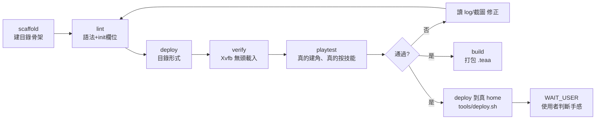

# addon-dev — 做一個 ToME4 addon

從零到「實機載入無錯誤」的一條龍。每個關卡都有可執行的檢查點，不靠肉眼判斷。

## 什麼時候用

使用者說「幫我做一個 ToME mod / 新職業 / 新技能 / 新物品 / 新 UI」。

小改（改一句描述、調一個數值）可以直接改檔 + `tools/lint.sh`，不必走完整流程。

## 前置：先讀真相層

**不要憑記憶寫 ToME 的 API。** 依序：

1. [docs/knowledge/](../../../docs/knowledge/) — 本專案已複驗過的引擎事實（附 `檔案:行號`）。
2. 沒有的話，去 `~/repo/moddings/tome4/vendor/t-engine4/` grep 原始碼，讀完把結論補進 `docs/knowledge/`。
3. 真實範例：`~/repo/moddings/tome4/vendor/orig/{arcanum,nullpack,midnight}/` 是實裝過的職業包。

`~/repo/moddings/tome4/docs/analysis/` 只當索引用，**不是權威**。

## 管線

開發時走 `lint → deploy(dir) → verify` 的短迴圈；改動觸及**遊戲邏輯**時再加跑 `playtest`；
`build` 只在要交付 `.teaa` 時跑。

## 各關卡

驗證分層，越後面越貴也越真。**前一層通過不代表下一層會過。**

| 關卡 | 指令 | 證明了什麼 | 證明不了什麼 |
|---|---|---|---|
| lint | `tools/lint.sh <addon>` | 語法正確、`init.lua` 欄位語意正確 | 任何 runtime 行為 |
| verify | `tools/verify.sh <addon>` | addon 被載入、定義註冊成功、載入無 Lua Error | **遊戲邏輯是不是對的** |
| playtest | `tools/playtest.sh start <addon>` … | 真的建得出角色、技能真的能施放、數值真的變動 | 好不好玩、平不平衡 |
| build | `tools/build.sh <addon>` | 能打包成合法 `.teaa` | — |
| 實機 | `tools/deploy.sh <addon>` → 使用者 | 手感與平衡 | — |

**verify 與 playtest 跑的是拋棄式 scratch home，不是使用者的 home。**
交付前一定要明確 `tools/deploy.sh <addon>`（不帶 `--home`），否則使用者的遊戲裡什麼都不會有。
使用者從 Steam 開遊戲會 SIGSEGV（引擎自身的工坊同步 bug，與 addon 無關）——
改用 `tools/run.sh`。兩件事都在 [docs/knowledge/real-machine.md](../../../docs/knowledge/real-machine.md)。

### verify 綠燈 ≠ 做完

2026-07-10，盧恩術士在 `verify.sh` 7/7 全綠的情況下，實機遊玩抓到三個 bug：
共鳴判定拿已翻譯的 `t.name` 比對英文（中文語系永不成立）、起始銘文因欄位滿被靜默丟棄、
符文字符在遊戲字型是豆腐方塊。三個都是「載入成功但行為錯誤」。

**只要改動觸及遊戲邏輯（天賦效果、資源、判定、UI 文字），就必須跑 playtest。**
細節與座標速查見 [docs/knowledge/playtesting.md](../../../docs/knowledge/playtesting.md)。

## 鐵律

- **絕不擅自在真實桌面跑 `t-engine64`**。它沒有 `--help`，任何參數都直接開遊戲視窗。自動化一律 `xvfb-run` + `--home <scratch>`（不必問）。要在真桌面開遊戲或用真滑鼠鍵盤，**先問使用者**，然後用 `tools/run.sh`（它會自己找出 XWayland 的 `DISPLAY` 與 `XAUTHORITY`）。
- **佈署到 `~/.t-engine/4.0/addons/`**，不碰 Steam 安裝目錄。`verify.sh` / `playtest.sh` 用的是 scratch home，**不會**佈署到這裡；交付前得自己跑 `deploy.sh`。
- `version` 必須與模組 1.7.6 相容，否則 addon 被**靜默移除**（`engine/Module.lua:394` 的 `natural_compatible`，`:595` 移除）。沒有錯誤訊息，只是不見了。
- 佈署後 addon **預設就啟用**——未列在 `addons.cfg` 的走 `engine/Module.lua:583` 的 else 分支。不必手動開啟。
- 目錄形式與 `.teaa` 形式**不可同時存在**，否則同一個 addon 載入兩次。`deploy.sh` 會先清另一種。

## Done when

一個 addon 算做完，當且僅當：

- `tools/lint.sh` 退出碼 0；
- `tools/verify.sh` 退出碼 0，且 log 有 `[X] hook complete`、無 `selfcheck ... = FAIL`、無 `Lua Error`；
- **若改動觸及遊戲邏輯**：`tools/playtest.sh` 實際建角並操作過，貼出截圖或 log 佐證；
  暫時的 `TEMP-DEBUG` 已移除，且移除後重跑過 lint + verify；
- 新增的引擎知識已寫進 `docs/knowledge/`，附 `檔案:行號`；
- **`tools/deploy.sh <addon>` 已跑過**（真 home，不帶 `--home`），且確認過使用者的遊戲 log 有
  `Checking addon tome-<x> :: (as dir) true` 與 `[X] hook complete`；
- 需要人眼確認的部分（手感、平衡）已列進 `WAIT_USER.md`。

「跑得起來」不等於「做完」，「載入成功」也不等於「行為正確」。
沒跑就說沒跑；貼輸出，不要只說「應該可以」。

## 狀態

- open 進度 → [session-log.md](session-log.md)
