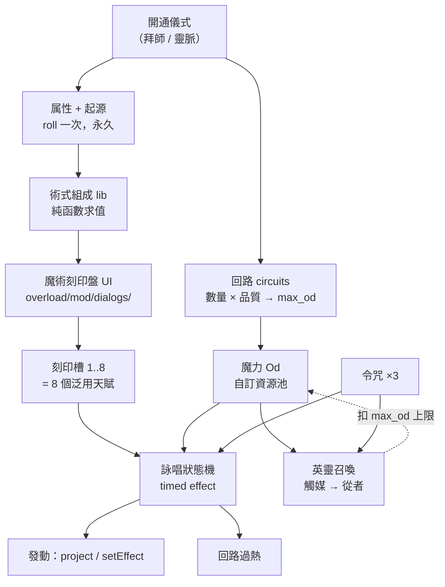

# 設計方案：型月魔術體系（tome-magecraft）

← [specs](README.md)｜討論日期 2026-08-03｜（直接由使用者構想起）

```text
Done when: 「與 ToME 天賦體系不同」具體是哪幾條講清楚、每條有引擎對應或標記待複驗、
           自訂 UI 的形狀與界線確定、與歐拉麗／Falna 的關係與工序寫死、不做範圍寫死
```

> 路徑代號 `E` = `vendor/t-engine4/engines/te4-1.7.6/`、`M` = `vendor/t-engine4/modules/tome/`。
> **本文件在辦公室 Windows 機器上寫成，該機 `vendor/` 是空的、沒有 luajit。**
> 凡引用 `docs/knowledge/` 的行號都是既有複驗結論；**新推論一律標 ⚠️待複驗**，
> 清單集中在 §11，到 Manjaro 開發機第一件事就是把它跑完。

> **使用者已拍板兩題（2026-08-03，本次對話）**：
> 1. **玩法主軸＝兩層都要**——你自己是魔術師（回路／詠唱／属性），也能召喚英靈。
> 2. **取得途徑＝區域門檻，任何角色可學**——不做專屬職業，走進那塊地、開通回路才有。

## 1. 一句話與定位

**一句話**：在歐拉麗隔壁再開一塊地，那裡的力量不是天賦點買來的，是**你把術式組出來、
用回路的魔力、花好幾回合詠唱出來的**。

定位跟 Falna 一樣：**ToME 原本的職業／天賦樹完全不動，這是疊上去的第二條軸。**
差別在 Falna 是「你做了什麼就長成什麼」（被動累積），魔術是「你想清楚要什麼，
親手把它組出來」（主動設計）。兩者正交，可以同時吃。

## 2. 「與 ToME 天賦體系不同」具體是哪五條

這節是整份設計的重點。含糊的「不同」沒有價值，以下五條每一條都是**可實作、
可驗證、玩家第一小時就感覺得到**的差異：

| # | ToME 天賦 | 魔術 | 為什麼這條重要 |
|---|---|---|---|
| 1 | 從固定清單挑，花天賦點 | **自己組成術式**（属性 × 系統 × 節數），不花天賦點 | 這是「新體系」的本體，也是自訂 UI 的理由 |
| 2 | 即時發動，一回合一招 | **詠唱吃 1–4 回合，會被打斷** | 戰鬥節奏根本改變。也是最大風險（§9） |
| 3 | 法力每回合自動回 | **魔力戰鬥中不回**，只能休息／靈脈／燒宝石 | 逼出「這一場我只能放三發」的資源決策 |
| 4 | 每個技能各自冷卻 | **全域回路過熱**，連放就自傷、詠唱變慢 | 冷卻從「等」變成「取捨」 |
| 5 | 學了就永遠會 | **刻印槽有限**（起手 3、最多 8），要換就得重刻 | build 是可重組的，不是一路長死 |

再加上兩個身分層的東西：**属性／起源**（開通時 roll，永久，決定你擅長什麼）
與**令咒**（3 次，用完基本上沒了）。

## 3. 架構總覽



四層，addon 暫名 `tome-magecraft`：

| 層 | 內容 | 為什麼分在這 |
|---|---|---|
| **資料層** `data/lib/formula.lua` | 属性表、系統表、節數表、組成求值（**純函數，不准碰 actor**） | 面板要能對「假如槽 3 換成三節火系干渉」這種假想狀態求值 |
| **狀態層** `hooks/` + `superload/` | 回路開通、魔力池、過熱、詠唱狀態機、從者供給 | 存檔安全性全部集中在這一層 |
| **天賦層** `data/talents/` | 8 個刻印槽天賦 + 開通/面板入口天賦 | 見 §5，這是繞開「天賦定義是靜態的」的關鍵 |
| **UI 層** `overload/mod/dialogs/` | 刻印盤、回路狀態、從者契約 | **只能放這裡**（§8） |

## 4. 魔力（Od）：自訂資源池

```lua
-- E/interface/ActorResource.lua:45
defineResource(name, short_name, talent, regen_prop, desc, min, max, params)
```

已複驗的四條限制（[class-parts/02 §4](../../../docs/knowledge/class-parts/02-resources-i18n-inscriptions.md)）：

- **`short_name` 必須是單一個字**（存取器由 `short_name:lower():capitalize()` 生成，`:68-73`）
  → 用 `"od"`，得到 `getOd` / `incOd`。剛好就是型月自己的用詞（オド＝體內魔力）。
- **必須在任何 actor 建立之前呼叫**（`:127-130`）→ 掛 `ToME:load` hook。
- **存取器只在 `knowTalent(pool_talent)` 為真時回傳實值**（`:87-94`）
  → **開通回路的那一刻必須同時 `learnTalent(T_MAGECRAFT_OD_POOL)`，否則魔力恆為 0**。
  這是最容易漏、且症狀是「什麼都不會動但也不報錯」的坑。
- `min`/`max` 預設 0/100，per-actor 上限走 `max_od` 欄位。

隱藏池天賦照抄 `M/data/talents/misc/misc.lua:127-134`（`T_MANA_POOL`）：
`mode="passive"`、`hide="always"`、`no_unlearn_last=true`。

### 4.1 上限：回路數 × 回路品質

開通時 roll 兩個永久欄位（型月設定裡回路是天生的、數量不可增）：

| 欄位 | 範圍 | 意義 |
|---|---|---|
| `circuits` | 10–60 | 回路數。決定 `max_od` 的量 |
| `circuit_quality` | E–A（1–5） | 品質。決定每點魔力的效率與過熱耐受 |

`max_od = circuits × (2 + quality)`。粗估 30 × 4 = 120 → 一場戰鬥放得起 3–5 發単節、
1 發三節。**這個數字是設計起點不是結論，等 v0.3 實機調。**

### 4.2 反轉重點：戰鬥中不回魔

`regen_prop` 每回合把 `self[regen_prop]` 加進資源（`:201`）。
**我們就讓它恆為 0**，不做「戰鬥中判定」——理由是簡單、沒有邊界情況，
而且「魔力只能靠外部補」正是這套體系的味道。回復管道只有三條：

| 管道 | 做法 | 節奏 |
|---|---|---|
| **休息** | rest 期間每回合補 | 回城／清完一層才回滿 |
| **靈脈** | 特定地形格上每回合補 | 給迷宮設計「安全屋」的錨點 |
| **宝石** | 消耗品，即時大量補 | 錢換魔力。接得上 ToME 既有的商店與掉落 |

> 宝石魔術本來就是型月的正典手法（把魔力預存進宝石裡）。這條讓「錢」在這塊地
> 有了跟原版不一樣的用途，不必另做貨幣。

## 5. 術式與刻印槽：怎麼繞開「天賦是靜態的」★

**這一節是整份設計的技術核心。**

### 5.1 硬限制

```lua
-- E/interface/ActorTalents.lua:26,91（註解自己寫著 -- Static!，在 :48,64）
_M.talents_def = {}          -- class-level，不是 per-actor
self.talents_def[t.id] = t   -- newTalent 寫進全域表
```

存檔裡只存天賦 **id 字串**，這張表每次載入從 data 檔重建
（[organic-talents §2.1](organic-talents-design.md)）。
→ **不能在執行期造一個天賦然後指望它活過存檔。**
「玩家組出一個新術式 = 生成一個新天賦」這條直覺路**是死的**。

### 5.2 解法：8 個泛用槽位天賦，行為在執行期讀資料

```lua
-- data/talents/sigils.lua
for i = 1, 8 do
  newTalent{
    short_name = "MAGECRAFT_SIGIL_"..i,
    name = "術式槽 "..i,             -- ⚠️ 顯示名是靜態的，見 §5.3
    type = {"magecraft/sigils", 1},
    mode = "activated",
    points = 1, hide = true,          -- 由開通儀式 learnTalent，不佔天賦點
    info   = function(self, t) return formula.describe(self.magecraft.sigils[i]) end,
    action = function(self, t) return caster.begin(self, i) end,
  }
end
```

`info` 是**函式**（`E/interface/ActorTalents.lua:76` 只要求 `info` 存在），
所以描述是動態的——滑鼠移上去看到的是你這一格實際刻的術式。

這樣白拿四件事，全部是自己重做會很痛的：**hotkey 列、冷卻顯示、`UseTalents` 清單、
AI 能不能用**。所有動態的部分都在 `actor.magecraft.sigils[i]`（純資料表，存檔友善）。

### 5.3 ⚠️ 已知代價：槽位天賦的**顯示名**改不動

`t.name` 在 `newTalent` 時就被 `_t(t.name, "talent name")` 處理掉
（`E/interface/ActorTalents.lua:88`，見 [class-parts/02 §5](../../../docs/knowledge/class-parts/02-resources-i18n-inscriptions.md)）。
所以 hotkey 上顯示的會是「術式槽 3」而不是「三節・火・干渉」。

三個對策，**建議先做 (a)，(b) 待複驗**：

- (a) 刻印盤 UI 與 `info` 顯示真名；hotkey 用槽號 + 顏色區分。可接受。
- (b) ⚠️待複驗：`hotkey` 顯示是否讀 `t.name` 還是有別的欄位可覆蓋。
- (c) 不做：superload 整個 hotkey 顯示，代價遠大於收益。

### 5.4 術式的三個維度

組成 = **属性 × 系統 × 節數**，求值全在 `data/lib/formula.lua` 的純函數裡。

| 維度 | 選項 | 決定什麼 |
|---|---|---|
| **属性** | 地・水・火・風・空・虚数 | `DamageType` 與副作用（地＝擊倒、水＝減速、火＝延燒、風＝擊退、空＝無視抗性但威力低、虚数＝放逐/位移） |
| **系統** | 干渉（直擊）・強化・変換・投影・使い魔・結界 | targeting 形狀與效果種類 |
| **節數** | 単節・二節・三節・大呪文 | 詠唱回合、耗魔、威力（非線性：三節 ≈ 単節 ×5，耗魔 ×4） |

6 × 6 × 4 = 144 組合，但**不是 144 個手寫技能**——是三張表加一個求值函數。
內容成本因此極低，這是選這個設計的實際理由之一。

> 設計約束（抄 [organic-talents §3.0](organic-talents-design.md) 的教訓）：
> **術式要走原版沒有的軸線**，不做「更好的火球」。
> 「投影」造臨時武器、「結界」改一塊地形、「使い魔」放偵察單位——
> 這些原版法師做不到，才值得多一套體系。

## 6. 詠唱：多回合、可被打斷

### 6.1 實作候選（⚠️待複驗，找原版前例）

| 候選 | 做法 | 評估 |
|---|---|---|
| **A 定時效果 ★推薦** | `setEffect(EFF_ARIA, n)` 倒數，`on_timeout` 到 0 時發動 | 自動存檔、自動顯示在狀態列、原版大量前例 |
| B 自建狀態機 | `callbackOnActBase` 每回合推進（同 director 的 `sceneStep` 思路） | 全部要自己序列化，沒必要 |

中斷靠回呼（總表 `M/mod/class/Actor.lua:6050-6060`）：
`callbackOnHit` 受擊中斷、`callbackOnMove` 移動中斷。
**中斷 = 魔力照扣、術式不發**——這是唯一能讓「保護詠唱者」變成真戰術的做法。

### 6.2 節奏保底（這是硬性要求，不是選項）

roguelike 玩家最恨的就是不能動。同 [orario §3.5.5](orario-complete-design.md) 的教訓，
必須有保底：

- **単節詠唱是即時的**（`no_energy` 為 false 但只吃 1 回合，跟原版技能一樣）
  → 日常戰鬥手感不變，多節只用在關鍵時刻。
- **高速神言**（稀有能力）：詠唱回合 −1，最低 1。
- **令咒**可以無視中斷、即時完成詠唱（§7）。

### 6.3 回路過熱

取代逐技能冷卻。每次施術累積 `heat += 節數²`，`heat` 每回合自然衰減 1。

| heat | 效果 |
|---|---|
| < 10 | 無 |
| 10–20 | 詠唱回合 +1 |
| > 20 | 每回合自傷（回路灼傷），且耗魔 +50% |

`circuit_quality` 高 → 閾值上調。休息清零。
⚠️待複驗：自傷要走 `DamageType` 還是直接 `takeHit`，以及會不會觸發別人的 `callbackOnHit` 連鎖。

## 7. 令咒：三次，用完就沒了

**不做成資源池**（沒有 regen，語意也不是池）。用 actor 欄位 `player.magecraft.seals = 3`。

三種用法，每次燒一劃：

1. **絕對命令**——從者瞬移到身邊，或強制它執行一個指令。
2. **魔力全回**——並解除當前的中斷與過熱。
3. **必中一擊**——下一發術式或宝具無視抗性與閃避。

補充管道只有劇情獎勵與聖杯碎片，**永久稀缺**。這是整套體系裡唯一「真的會捨不得用」
的資源，價值在於它創造決策壓力，不在於它強。

## 8. 自訂 UI：魔術刻印盤

已複驗的規則全在 [custom-ui.md](../../../docs/knowledge/custom-ui.md)，
**現成範本就在本 repo**：`self_mods/tome-runewright/overload/mod/dialogs/RunewrightRuneBoard.lua`
（符文盤，跟刻印盤是同一種問題）。

| 規則 | 出處 |
|---|---|
| **dialog 必須放 `overload/mod/dialogs/`**，放 `data/` 的話 `require` 永遠找不到 | custom-ui §1（`E/Module.lua:498-503` vs `:519-524`） |
| `init.lua` 要加 `overload = true`，否則目錄不掛載 | 同上 |
| 排版用 `self.iw` / `self.ih`（內容區），不是 `self.w` / `self.h` | custom-ui §2 |
| **一定要 `EXIT` 綁 `unregisterDialog`**，否則面板關不掉又吃光鍵盤 | 同上 |
| 入口用 `mode="activated"` + `no_energy=true` 的天賦（前例 `M/data/talents/cursed/cursed-aura.lua:255-258`） | custom-ui §4 |
| **面板不准自己算業務邏輯**，全丟純函數 lib | custom-ui §6 |

最後一條在這裡尤其硬：刻印盤要即時回答「假如我把槽 3 從二節・水・干渉換成
三節・火・投影，耗魔多少、詠唱幾回合、跟我的属性合不合」——這是對**假想狀態**求值，
`formula.lua` 必須是純函數（不准碰 actor），跟符文盤的 `resonance.lua` 一模一樣。

三個面板：

| 面板 | 內容 |
|---|---|
| **刻印盤** | 8 個槽、左列表選槽／右三欄選属性系統節數、即時顯示差異 |
| **回路** | 回路數／品質／属性／起源／目前魔力／過熱 |
| **契約** | 已契約從者、魔力供給佔用、令咒剩餘 |

測 UI 的三個坑（面板吃掉 `ctrl+L`、`playtest.sh lua` 結尾的 Escape 會關掉面板、
Xvfb 下畫面平移 200px 是假象）照抄 custom-ui §5，**別重新踩**。

## 9. 英靈召喚：兩層之間的牽制

使用者選了「兩層都要」，所以**必須正面解決「兩套系統會不會變成純加法」**。

### 9.1 牽制設計：從者吃你的回路上限

```lua
-- 契約成立時
self.__servant_drain = self:addTemporaryValue("max_od", -servant.upkeep)
```

語意直白：**你的回路被綁去供給從者了**，所以你自己幾乎施不了術。
數量級建議：一個從者吃掉 50–70% 的 `max_od`。

於是玩家每一場都要選邊：**自己當砲台，還是當供魔的後盾。**
這正是型月設定裡御主與從者的真實關係，不是硬湊的平衡補丁。
⚠️待複驗：`max_od` 是否吃得下 `addTemporaryValue`（資源上限欄位由 `:127-130` 在 init 寫入，
確認它是普通欄位而非唯讀）。

### 9.2 從者怎麼做

接既有的 `self_mods/tome-companions/` 與
[companions-and-party.md](../../../docs/knowledge/companions-and-party.md)——
**入隊、可操控、隨主人成長這條路本 repo 已經走通過**（歐拉麗酒館三名冒險者）。

- **召喚要觸媒**：觸媒是迷宮掉落物，決定召喚出哪個 class。
  這給了「刷」的動機，而且**不需要抽卡**。
- **7 個 class**（Saber/Archer/Lancer/Rider/Caster/Assassin/Berserker），
  各有一條 class skill 被動。
- **宝具**：從者的一次性大招，耗大量魔力或一劃令咒。
- ⚠️**規模警告**：7 個 class × 貼圖 × 技能 × 對白 ≈ 一整期的量。
  v0.6 只做**一個** class 走通全流程，七個是 v0.7 的事。

### 9.3 著作權：只用公有領域的原型

同 [orario §6.1](orario-complete-design.md) 的論述，但這裡**運氣好很多**：
型月的從者多半取材自**歷史與神話人物**（亞瑟王、庫丘林、荊軻、阿爾忒彌斯……），
那些原型本身是公有領域。

→ **做原型，不做該作品的角色設定與台詞。** 不用該作品的專有名詞當人名，
不照抄人物性格與對白。世界觀取材、機制致敬，人物自己寫——跟歐拉麗同一條線。

## 10. 世界：放在歐拉麗隔壁

Eyal 大地圖現況（`self_mods/tome-orario/hooks/load.lua:7-11`）：

| 佔用 | 座標 |
|---|---|
| 德斯城（原版） | (25,17) |
| runeisles | (23,17) |
| tome-camp | (24,17) |
| **歐拉麗**（3×3 overlay，佔 24–26 × 17–19） | **(25,18)** |

→ 提議 **(28,18)**：歐拉麗東邊、隔一格不與那個 3×3 overlay 重疊。
⚠️待複驗：該格在原版地圖上是不是可放置的地形、有沒有撞到原版地點。

### 10.1 這塊地是什麼

**不做冬木**——Eyal 是奇幻世界，現代日本市街接不上，也沒有前例可抄。
改成**時計塔式的學院都市**，這個意象既忠於取材，又接得上 ToME 的既有做法：

| zone | 性質 | 抄哪裡 |
|---|---|---|
| **分院**（hub） | 拜師開通回路、換觸媒、宝石商、接委託 | 歐拉麗中央廣場，同一套四件式 |
| **靈脈迷宮** | 程序生成地城，掉觸媒與宝石，有靈脈安全格 | 巴別塔（Roomer 生成） |

劇情高潮（v1.0 級）：**小型聖杯戰爭**——幾組御主與從者在一張圖上互殺。
這一定要用 `tome-director`（[scripted-scenes.md](../../../docs/knowledge/scripted-scenes.md)），
而且它會是 director 的第二個真實使用者，剛好驗出 step 種類夠不夠用。

### 10.2 與歐拉麗的世界觀關係

兩座城互相知道對方存在，**但技術不互通**：
Falna 是神給的恩惠（你做了什麼就長成什麼），魔術是人累積的技術（你想清楚才做得出來）。
一句設定就把兩套系統的並存講圓了，也解釋了為什麼一個角色可以同時吃兩邊——
**你是唯一同時被神祝福又學了魔術的人**，這本身就是劇情鉤子。

## 11. ⚠️ 複驗清單（到 Manjaro 開發機第一件事）

| # | 要驗什麼 | 怎麼驗 |
|---|---|---|
| 1 | `max_od` 吃不吃 `addTemporaryValue`（§9.1 的牽制靠它） | 讀 `E/interface/ActorResource.lua:127-130`，寫最小測試 |
| 2 | 有沒有原版的「多回合詠唱」前例可抄 | `grep -rn "on_timeout" M/data/timed_effects/` 找倒數後發動的 |
| 3 | hotkey 顯示是不是只讀 `t.name`（§5.3） | 讀 `M/mod/dialogs/`／`M/mod/class/Player.lua` 的 hotkey 繪製 |
| 4 | `callbackOnMove` / `callbackOnHit` 的實際觸發時機與參數 | `M/mod/class/Actor.lua:6050-6060` 往回追 |
| 5 | Eyal (28,18) 是什麼地形、有沒有撞到原版地點 | 讀 `M/data/maps/wilderness/eyal.lua` |
| 6 | 過熱自傷走 `DamageType` 還是 `takeHit`，會不會觸發連鎖 | 找原版自傷技能（如 Bloodspring 系）對照 |
| 7 | `defineResource` 的 `params` 有哪些欄位可用 | `E/interface/ActorResource.lua:45-130` 通讀 |

**在 1、2 兩項有結論之前不要開工**——它們分別是「兩層牽制」與「詠唱」的地基，
垮掉的話 §6 與 §9 都要重設計。

## 12. 分期

每期獨立可 playtest。**先驗手感，再堆內容**——這是本設計最重要的排序原則。

| 期 | 內容 | 為什麼這個順序 |
|---|---|---|
| **v0.1 回路與魔力** | `defineResource("Od")`、開通儀式、回路數／品質、回路狀態面板 | 地基。存檔往返要驗透 |
| **v0.2 術式與単節詠唱** | `formula.lua` 純函數、8 個槽位天賦、刻印盤 UI 第一版、只做単節（即時） | **先證明「組成式」比「挑天賦」好玩**，此時還沒引入多回合風險 |
| **v0.3 多節詠唱＋過熱** ★ | 二／三節、中斷、heat | **生死關**（§13）。這一期做完必須實機試玩才決定要不要繼續 |
| **v0.4 属性與起源** | roll、相剋、起源修正 | 純數值，低風險，補 build 深度 |
| **v0.5 分院與靈脈迷宮** | 兩個 zone、宝石商、觸媒掉落 | 純抄歐拉麗現成手法，可交給 sonnet agent |
| **v0.6 召喚（1 個 class）** | 觸媒 → 契約 → `max_od` 佔用 → 一個從者走通全流程 | **只做一個**，驗牽制是否成立 |
| **v0.7 七 class ＋ 宝具 ＋ 令咒** | 內容量最大的一期 | 框架驗過後是純內容，可交給 pi + deepseek |
| **v0.8 劇情** | 用 director 做主線與小型聖杯戰爭 | director 的第二個使用者 |
| **v1.0** | 平衡、文案、美術收尾 | — |

## 13. 最大的風險，講在前面

**「多回合詠唱」在 roguelike 裡可能就是不好玩。**

它在小說裡很帥，但在 ToME 的實際節奏裡，「站著不動三回合、被打一下就白費」
很可能只是純粹的挫折。這件事**無頭測試證明不了，只有實機手感能判斷**
（AGENTS.md 鐵律 6）。

所以 v0.3 是硬性的檢查點：

- 做完就停下來，交給使用者實機試玩，**不先做 v0.4 以後任何內容**。
- 若手感是壞的，**退路是把節數改成「威力／耗魔的檔位」而不是「回合數」**——
  體系其餘四條差異（組成、不回魔、過熱、槽位）全部不受影響，只賠一期。
- 這條退路要在 v0.2 設計 `formula.lua` 時就預留：**節數對「回合數」的映射要是一張可換的表**，
  不要把回合數硬寫進求值邏輯。

## 14. 明確不做

- **不做抽卡／課金模擬。** 從者靠觸媒掉落取得，那是 roguelike 該有的形狀。
- **不逐一還原原作角色。** 只用公有領域的歷史／神話原型（§9.3）。
- **不做專屬職業。** 已拍板走區域門檻（但代價是要設計「不是白送」的開通成本）。
- **不取代 ToME 的法術系統。** 魔術是第二條軸，動原本那條會炸掉所有既有 addon。
- **不做即時制／QTE／指令卡。** 引擎是回合制，硬改是另一個量級的工。
- **不做完整的七組御主 AI 對抗。** 同 orario 不做 War Game——聖杯戰爭走演出與腳本，
  不做大規模陣營對抗機制。
- **不做獨立 campaign。** 維持「從 Eyal 大地圖走進去」，跟歐拉麗一致。

## 15. 工序：與 Falna 的關係

2026-08-03 已拍板 [orario §8](orario-complete-design.md) 方案 3——**歐拉麗當試驗場**，
先做 Falna，跑通再抽通用框架。

**這套魔術體系是那個框架的第二個使用者**，而且是最好的驗證題材：

| 通用框架的機制 | 歐拉麗叫什麼 | 這裡叫什麼 |
|---|---|---|
| 隱藏節點動態顯示（`__show_special_talents`） | スキル覺醒 | 術式解禁（新属性／新系統） |
| 行為累積 → 數值（回呼 + `inc_stats`） | Falna 五能力值 | 回路品質提升（用得多才練得起來） |
| `PartyIngredients` 素材經濟 | 魔石 | 觸媒與宝石 |
| 自訂資源池 | —— | 魔力 Od |

**建議：不在 Falna v0.7（Falna 核心）之前開工。**
理由是抽象化需要第二個具體案例才做得準——但那第二個案例得在第一個跑通之後才有意義。
**這份 spec 現在就寫是對的**，因為它會反過來影響框架該長什麼樣（例如「自訂資源池」
這一列，Falna 自己不需要，是這裡才冒出來的需求）。

## 16. 待使用者決定

1. **addon 名字**：`tome-magecraft`（機制取向）／`tome-clocktower`（地點取向）／其他。
2. **開通成本要多重**？走區域門檻＝人人可得，所以「不是白送」得靠成本
   （長跑腿任務？大筆錢？永久扣一點什麼？）。這題直接決定平衡。
3. **從者要不要具名**？公有領域原型是安全的，但「叫什麼名字」是文案品味題，你來定。
4. **詠唱的容忍度**（§13）——你能接受最長幾回合？這個數字決定 `formula.lua` 的表怎麼填。
5. **座標 (28,18) 可以嗎**？（要在有 `vendor/` 的機器上確認，見 §11-5）

## 17. 產出分工（依 [agent-driving](../agent-driving/README.md)）

| 工作 | 交給誰 |
|---|---|
| §11 複驗清單 | 主 agent，全部要附行號 |
| `formula.lua` 純函數 ＋ 槽位天賦（v0.2） | 主 agent，機制敏感 |
| 刻印盤 UI | 主 agent 起骨架（抄符文盤），細部可交 sonnet |
| 分院／靈脈迷宮 zone（v0.5） | sonnet agent，純抄歐拉麗現成手法 |
| 七 class 從者資料列（v0.7） | pi + deepseek |
| 貼圖／圖示 | 先沿用原版 `npc/`；真要自製走 `agy`，**送使用者肉眼審核** |
| 中文文案 | **一律使用者審** |
