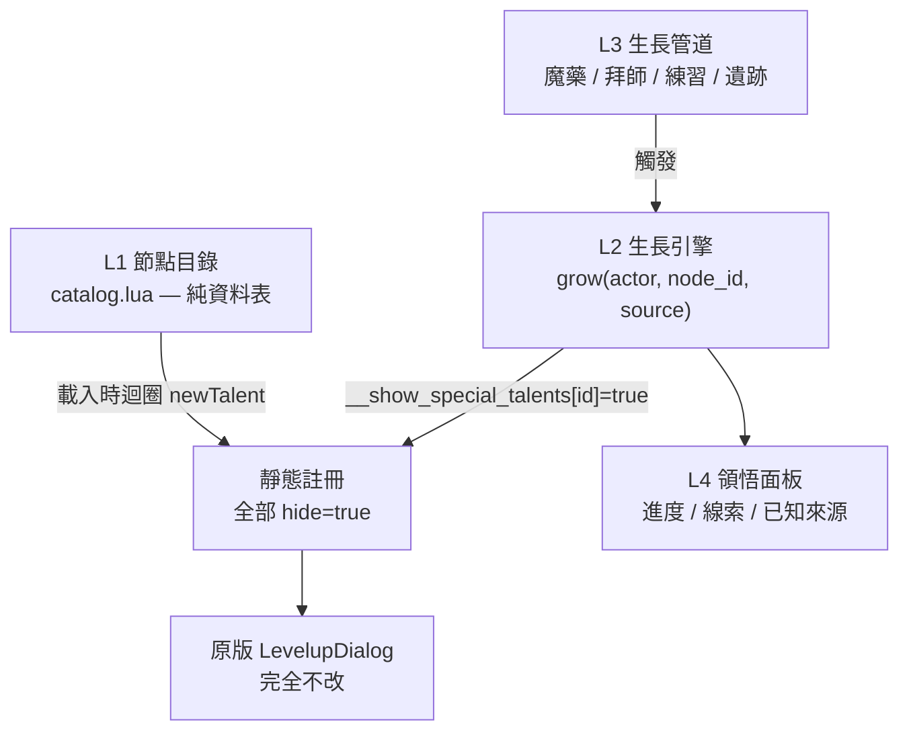

# 設計方案：生長式天賦（Organic Talents）

← [specs](README.md)｜討論日期 2026-08-01

```text
Done when: 引擎可行性有行號證據、架構分層確定、內容規模與分期確定、
           不做範圍寫明、可進 plan
```

> 路徑代號 `E` = `vendor/t-engine4/engines/te4-1.7.6/`、`M` = `vendor/t-engine4/modules/tome/`。

## 1. 構想

一句話：**類似 POE 的天賦樹，但節點不是一開始就攤在那裡——是透過遊戲中的行為「長」出來的。**

生長管道（使用者原話）：實用魔藥、拜師學習、自我練習領悟……

UI 不走 POE 的樹狀圖，**沿用 ToME 原有的技能樹介面**，但每棵樹底下可以動態新增節點。

## 2. 引擎可行性：可行，而且引擎自己就內建這個機制

### 2.1 最重要的一條限制：天賦定義是**全域靜態**的

```lua
-- E/interface/ActorTalents.lua:26,91
_M.talents_def = {}          -- class-level，不是 per-actor
...
self.talents_def[t.id] = t   -- newTalent 寫進全域表
```

`newTalentType` / `newTalent` 的註解本身就寫著 `-- Static!`（`E/interface/ActorTalents.lua:48,64`）。
這張表在**每次載入遊戲時從 data 檔重建**，存檔裡只存天賦 **id 字串**。

> **所以：不能在執行期憑空造一個天賦然後指望它活過存檔。**
> 任何「動態生成天賦」的直覺做法都會在讀檔時變成指向不存在 id 的孤兒。

### 2.2 但引擎已經有 per-actor 的「顯示／隱藏」開關

```lua
-- M/mod/dialogs/LevelupDialog.lua:528
if not t.hide or self.actor.__show_special_talents[t.id] then
```

- 定義時 `hide = true` → 技能樹裡**看不到**這個節點。
- `actor.__show_special_talents[t.id] = true` → **只對這個角色**顯示出來。
- `__show_special_talents` 是普通 actor 欄位，**不在 `_no_save_fields` 裡**
  （對照 `M/mod/class/Actor.lua:79` 明確排除了 `__project_source`，證明 `__` 前綴本身不影響存檔）
  → **會存檔**。

**原版就有三個先例**，不是我們發明的用法：

| 先例 | 位置 | 語意 |
|---|---|---|
| 護送任務獎勵教你一個隱藏天賦 | `M/mod/class/EscortRewards.lua:536` | 「拜師學習」的原型 |
| 毒藥配方：學會才在樹裡長出來 | `M/data/talents/cunning/poisons.lua:614-617` | **「實用魔藥」的原型**，連 `on_unlearn` 收回都有 |
| Uber 天賦解鎖異種武器精通 | `M/data/talents/uber/str.lua:246` | 條件達成才出現 |

`poisons.lua` 那條特別重要——它證明**「節點在既有樹底下動態出現」在原版就是成熟玩法**，
只是原版只用了一棵樹、寥寥幾個節點。我們要做的是把它放大成一整套體系。

### 2.3 樹本身也能動態長出來

`LevelupDialog.lua:506` 的條件包含 `not (self.actor.talents_types[tt.type] == nil)`——
actor 的 `talents_types` 沒有這個 key 的樹**整棵不顯示**。
`E/interface/ActorTalents.lua:987-997` 的 `learnTalentType(tt, v)` 是 per-actor 且會 `self.changed = true`。

所以「發現一個全新的知識領域 → 整棵新樹出現在你的技能畫面上」也成立。

### 2.4 撈到的額外槓桿：`require.special` 讓節點「看得見但灰著」

`canLearnTalent`（`E/interface/ActorTalents.lua:742-793`）**從頭到尾沒有檢查 `hide`**
——隱藏節點完全可以正常學習、正常使用。它檢查的是 `require.special.fct`，
失敗時回傳 `require.special.desc` 這個**自訂字串**，而 `LevelupDialog.lua:417` 會把它顯示給玩家。

於是我們有**兩級可見度**，可以混用：

| 級別 | 做法 | 玩家體驗 |
|---|---|---|
| **神秘** | `hide = true` | 完全看不到。長出來才知道世上有這東西 |
| **引路** | 可見 + `require.special.desc = "需向草藥師拜師"` | 看得到、灰著、滑鼠上去告訴你怎麼長出它 |

「引路」級是 POE 手感的關鍵——玩家看得到前方的路，才有動機去追。
建議：**每個領域的入口節點用引路級，深處節點用神秘級。**

### 2.5 `hide` 的副作用（會影響哪些別的 UI）

節點一旦學會就到處都正常，但**沒學會時** `hide` 也影響這些地方，設計時要知道：

| 位置 | 行為 |
|---|---|
| `M/mod/dialogs/CharacterSheet.lua:1377` | 用 `t.hide ~= "always"`——`hide = true` 仍會顯示在角色卡 |
| `M/mod/dialogs/UseTalents.lua:301` | 隱藏的**被動**不列入使用清單（本來就該如此） |
| `M/mod/class/interface/PlayerDumpJSON.lua:306` | 隱藏天賦不進角色 dump |

`hide = "always"` 是更強的一級，需要時可用。

### 2.6 規模參考

原版：**1291 個天賦、295 棵樹**（`grep -c` 於 `M/data/talents/`）。
預先註冊幾百個隱藏節點對引擎完全不是問題。**瓶頸是內容產出，不是引擎。**

## 3. 架構

四層。名稱暫定 addon `tome-organic`。

### 3.0 定位：通用系統（2026-08-01 使用者決定）

**不綁職業。任何角色都吃得到這套系統**——這最貼近構想（喝魔藥、拜師、練習領悟本來就不該挑職業）。

發放方式：掛 `ToME:birthDone` hook（`M/mod/class/Game.lua:336,386`），
建角完成時對 player 呼叫 `learnTalentType("organic/<領域>", true)`，把生長樹掛上去。
既有存檔的角色則在載入時補發（同一個函式，冪等）。

**通用帶來的兩個代價，設計上必須正面處理**：

| 代價 | 對策 |
|---|---|
| 人人多一套樹＝人人變強，膨脹平衡 | 生長門檻要真的有成本（跑腿、付錢、消耗品、時間），不是白送；且大節點要花天賦點（§L2） |
| 與各職業既有樹重疊（例如法師本來就有火球） | 目錄設計原則：**生長節點走「原版沒有的軸線」**（工具性、環境互動、跨領域組合），不做「更好的火球」 |

**不改任何原版樹**（§5 已列不做）。通用只表示「這棵新樹發給所有人」，不表示去動別人的樹。



### L1 節點目錄（靜態、資料驅動）

**這是讓內容量可控的關鍵決定**：節點不是一個個手寫 `newTalent{...}`，
而是寫成一張資料表，載入時用迴圈生成。內容產出因此變成「填資料列」，
可以交給 pi + deepseek 大量產、交給 `tools/lint.sh` 驗。

```lua
-- data-organic/catalog/herbalism.lua
return {
  { short_name = "OG_HERB_SALVE", name = "草藥膏", tree = "organic/herbalism",
    tier = 1, mode = "activated",
    grow = { sources = {"brew", "mentor"}, seeds = {}, visibility = "guide" },
    -- ↓ 以下是一般 newTalent 欄位，原樣傳進去
    cooldown = 8, range = 1, action = function(self, t) ... end, ... },
}
```

`grow` 這個表是**我們自己的欄位，引擎完全不認得也不會干擾**——
`newTalent` 只 assert `name`/`type`/`info`（`E/interface/ActorTalents.lua:67,68,76`），其餘欄位原封不動掛在 `t` 上。

`seeds` = 「要先有哪些節點才能長出我」，這就是 POE 的「相鄰性」，
但**不需要畫圖**——它是一個有向圖，用 L4 面板列出來即可。

### L2 生長引擎（per-actor、會存檔）

```lua
actor.organic = {
  grown    = { OG_HERB_SALVE = "brew" },   -- 節點 → 從哪個管道長出來的
  progress = { herbalism = 137 },          -- 各領域的領悟累積
  clues    = { OG_HERB_TONIC = true },     -- 已知但還沒長出（面板可顯示線索）
}
```

單一入口函式，所有管道都走它：

```lua
function grow(actor, node_id, source)   -- 檢查 seeds → 設 __show_special_talents → 記錄 → logMessage + 特效
```

**點數成本：混合兩種節點**（2026-08-01 使用者決定）

目錄每列帶一個 `grow.cost`：

| 節點類型 | `cost` | 行為 |
|---|---|---|
| 小節點（被動、小幅加成、工具性） | `"free"` | 長出來直接生效，`learnTalent(id, true)` 白送 1 點 |
| 大節點（主動技能、關鍵被動） | `"point"` | 長出來只是解鎖可點性，要花天賦點投資 |

兩種都靠同一個 `grow()` 入口，差別只在最後一步要不要順手 `learnTalent`。
規則複雜度的代價落在**目錄怎麼分類**，不在程式碼——這正好是可以慢慢調的設計旋鈕。

### L3 生長管道

| 管道 | 掛在哪 | 已有的知識 |
|---|---|---|
| **實用魔藥** | 物品的 `use_simple` | `docs/knowledge/items-and-egos.md`、`crafting-and-imbue.md` |
| **拜師學習** | NPC 對話樹（可能要付錢／做任務） | `docs/knowledge/npc-and-chats.md`、`quests-and-lore.md` |
| **自我練習領悟** | 累積使用某類天賦 N 次 → 領域進度滿 | ⚠️ **ToME 沒有 `postUseTalent` hook，只能 superload**（`class-parts/01-birth-and-talents.md:109-128`） |
| **探索遺跡／古卷** | zone 物件、戰利品 | `docs/knowledge/worldmap-and-zones.md` |

### L4 領悟面板（唯一要新寫的 UI）

技能樹本身**一行都不改**。新寫的是一個「領悟」對話框：
各領域進度條、已長出的節點與來源、已知線索、下一步提示。
`docs/knowledge/custom-ui.md` 已有 127 行的自製 UI 知識，照它做。

## 4. 分期

| 期 | 內容 | 為什麼是這個順序 |
|---|---|---|
| **P0 垂直切片** | 1 棵新樹（草藥學）、8–10 個節點、**三種管道各 1 個實例**、grow() 引擎、存檔往返驗證 | 先證明整條路走得通。管道各一個實例是重點——三種管道的技術風險完全不同 |
| **P1 面板** | L4 領悟面板 + 解鎖特效／訊息 | 沒有面板玩家不知道系統存在 |
| **P2 內容量產** | 目錄擴到 3–5 個領域、80–150 節點 | 資料驅動後這一期可以交給 pi + deepseek 跑，`lint.sh` 把關 |
| **P3 整合** | 與 `tome-witch` 等既有 addon 掛勾、平衡 | 最後做，因為要有量才看得出平衡 |

**P0 就要驗的三件事**（做不到就整個設計要重想）：

1. 存檔往返：長出節點 → 存檔 → 讀檔 → 節點還在、還能點。
2. 目錄變更的容錯：從目錄刪掉一個節點，舊存檔讀不讀得起來（`__show_special_talents` 會指向不存在的 id）。
   → 需要在 load hook 裡清理孤兒 id。
3. 引路級節點的 `require.special.desc` 在技能樹裡真的顯示得出中文提示。

## 4.5 設計空間：引擎給你的原語

> 這一節是**給使用者發想用的**。下面每一條都已用行號複驗過。
> §5「不做」與§6 的建議都是主 agent 的暫定值，隨時可被推翻——
> **但如果一個想法違反 §4.6 的硬牆，那不是取捨問題，是做不到。**

| 原語 | 怎麼做 | 能拿來玩什麼 |
|---|---|---|
| **節點對單一角色現形** | `hide=true` + `actor.__show_special_talents[id]=true`（`LevelupDialog.lua:528`），會存檔 | 生長的核心 |
| **節點看得見但灰著，附自訂理由** | `require.special.desc = "需向草藥師拜師"`（`ActorTalents.lua:766-768`，顯示於 `LevelupDialog.lua:417`） | 引路、下線索、吊胃口 |
| **整棵樹動態出現** | `learnTalentType(tt, true)`（`ActorTalents.lua:987`）；樹不在 `actor.talents_types` 就整棵隱形（`LevelupDialog.lua:506`） | 「發現一個全新知識領域」 |
| **樹的精通倍率可變** | `actor.talents_types_mastery[tt]`、`__increased_talent_types`（`ActorTalents.lua:956-966`） | **領悟「深度」可以是倍率，不只是節點數**——同一棵樹越鑽越強 |
| **互斥分支（POE 的 keystone）** | `require.talent = { {"T_FOO", false} }` → 「必須**不**會 T_FOO」（`ActorTalents.lua:783-786`） | 走了這條路就永遠走不了那條，引擎原生支援 |
| **前置節點（相鄰性）** | `require.talent = { {"T_FOO", 2} }` → 需 T_FOO 達 2 級 | 樹狀圖的「邊」，不必畫圖也成立 |
| **白送 / 收回節點** | `learnTalent(id, true)` / `unlearnTalent`，配 `on_learn` / `on_unlearn`（`poisons.lua:614-617` 兩邊都寫了） | 暫時性領悟、會遺忘的知識、可重置 |
| **每回合／受擊／移動時觸發** | `callbackOnActBase` 等，總表在 `M/mod/class/Actor.lua:6050-6060` | 「自我練習」的累積計數 |
| **攔截天賦使用** | ⚠️ ToME **沒有** `postUseTalent` hook，只能 superload（`class-parts/01-birth-and-talents.md:109-128`） | 同上，但成本較高 |
| **點數池** | `actor.unused_talents` / `unused_talents_types` | 另一種獎勵幣別 |

## 4.6 硬牆（違反就是做不到，不是取捨）

1. **不能在執行期造出新天賦。** 定義是全域靜態、每次載入重建，存檔只存 id 字串（§2.1）。
   任何「程序生成獨一無二的天賦」只能是「從預寫好的目錄裡挑」。
2. **天賦 id 撞名直接 assert 崩潰**（`ActorTalents.lua:92`）。目錄要有前綴命名規則。
3. **`newTalentType` 同 type 重複定義靜默覆蓋**（`ActorTalents.lua:59-60`）——壞掉不會有錯誤訊息。
4. **目錄刪節點會讓舊存檔留下孤兒 id**，載入時要清（P0 驗證項 2）。
5. **UI 沿用原版樹的話，節點就是清單不是圖**。要真的畫出 POE 那種放射狀連線圖，
   等於自己寫一個 UI——技術上做得到（`docs/knowledge/custom-ui.md`），但那是另一個量級的工。

## 5. 明確不做

- **不重寫技能樹 UI**。POE 那種放射狀圖不做——沿用原版 LevelupDialog 是本設計最大的成本節省。
- **不把節點塞進原版的樹**（如 `cunning/poisons`）。技術上可行，但會與其他 addon 互相干擾、
  且原版樹有自己的 `points` 上限邏輯。**自己開樹。**
- **P0 不做框架化**。不做「別的 addon 可以註冊節點進來」的公開 API，等真的有第二個使用者再說。
- **不做隨機生成節點**。§2.1 的靜態限制決定了節點必須預先存在；「隨機」只能是
  「從靜態目錄裡隨機挑一個給你」，不是憑空造。

## 6. 待使用者決定

1. **規模**：P0 的 8–10 節點是不是太小／太大？
2. **掛在哪**：獨立新職業，還是做成「任何職業都能用」的通用系統（後者更貼近構想，但要處理與各職業既有樹的關係）？
3. **花不花天賦點**（§L2 的建議是「要」）。
4. **領悟進度怎麼累積**：使用次數？造成傷害量？擊殺數？探索格數？這決定 superload 掛哪裡。

## 7. 產出分工（依 [agent-driving](../agent-driving/README.md)）

| 工作 | 交給誰 |
|---|---|
| L1 目錄資料列（大量、格式固定） | pi + deepseek |
| L2/L3 引擎與管道程式碼 | 主 agent 或 pi，需複驗 |
| L4 UI | 主 agent（UI 細節多） |
| 節點圖示、藥劑貼圖 | `agy` cli，**產出一律送使用者肉眼審核** |
| 節點名稱／描述文案 | `agy` 或 deepseek，**中文文案須使用者審** |
